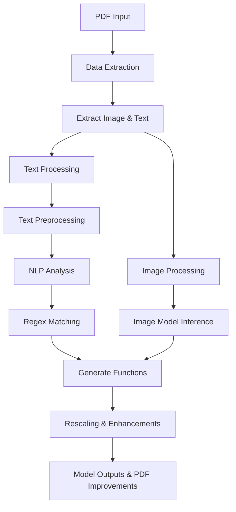
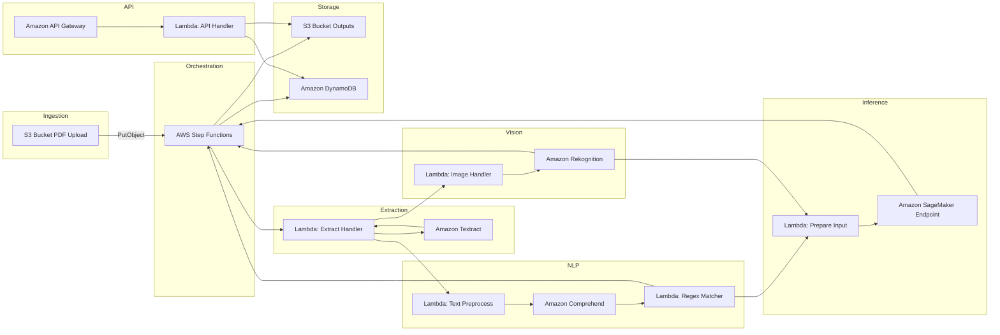

# Architecture Diagram

## Proyect Pipeline Diagram

The **project pipeline** outlines the end-to-end flow for processing PDF documents. It begins with the ingestion of a PDF file, followed by a data extraction phase where both images and text are separated. The extracted text undergoes several processing steps, including preprocessing, NLP analysis, and regex-based pattern matching. Simultaneously, images are processed through dedicated inference models. The results from both text and image analysis are then combined to generate new functions and enhancements, such as image rescaling and PDF optimization. This pipeline ensures that both textual and visual information from the document are thoroughly analyzed and enriched, resulting in higher-value outputs.

## AWS Pipeline Diagram

The **AWS pipeline** implements the above logic using managed and serverless AWS services. The process starts when a PDF is uploaded to an S3 bucket, triggering an event that launches an AWS Step Functions workflow. This orchestrates a series of Lambda functions: one for extracting text and images with Textract, others for analyzing text with Comprehend and regex, and for processing images with Rekognition. The extracted and analyzed data is then sent to a SageMaker endpoint for custom inference, with final results stored in S3 and indexed in DynamoDB. An API Gateway exposes a RESTful API, allowing external applications to retrieve processed outputs and metadata. This architecture leverages AWS scalability, resilience, and cost-effectiveness, enabling efficient and secure processing of large volumes of documents.

## Services Overview

- **Amazon S3**  
  Acts as the central storage for both input PDFs and output artifacts, offering virtually unlimited scalability and durable object storage.  

- **AWS Step Functions**  
  Coordinates each processing step with a visual state machine, handling retries, error handling, and parallel branches without custom code.  

- **AWS Lambda**  
  Hosts lightweight handlers for invoking Textract, Comprehend, Rekognition, and SageMaker, scaling automatically with demand and charging only for execution time.  

- **Amazon Textract**  
  Performs OCR on PDFs to extract text, forms, and tables, returning structured JSON for downstream processing.  

- **Amazon Comprehend**  
  Applies NLP to detect entities, key phrases, sentiment, and syntax, enabling semantic enrichment of extracted text.  

- **Amazon Rekognition**  
  Conducts image analysis on embedded graphics or scanned figures, detecting labels, text, and custom objects via trained models.  

- **Amazon SageMaker Endpoint**  
  Hosts custom ML models (e.g., specialized classifiers or image enhancers) for real-time inference with autoscaling.  

- **Amazon DynamoDB**  
  Stores metadata, extraction results, and indexing information in a low-latency NoSQL database for rapid lookups.  

- **Amazon API Gateway**  
  Exposes a RESTful API to retrieve processed outputs and metadata, handling authentication, throttling, and monitoring.  

## Real-World Workflow and Usage

1. **PDF Ingestion & Triggering**  
   Users or other systems upload PDFs to an S3 bucket, which emits an S3 PutObject event to start the Step Functions workflow.

2. **Orchestrated Processing**  
   The state machine first invokes a Lambda that calls Textract asynchronously for OCR, then runs parallel branches: one for text analysis via Comprehend and regex matching, another for image analysis via Rekognition.

3. **Custom Inference & Storage**  
   After extraction, a Lambda prepares inputs for a SageMaker endpoint that applies any domain-specific model (e.g., document classification or image enhancement), with results written to S3 and indexed in DynamoDB.

4. **API Access & Integration**  
   Downstream applications invoke API Gateway, which triggers a Lambda to fetch processed data from S3 or DynamoDB, delivering JSON payloads for UI dashboards or further analytics.

5. **Scalability & Resilience**  
   All components are serverless and autoscaling, ensuring cost-effectiveness—users only pay for actual compute and storage usage, and Step Functions retries on transient failures, boosting reliability under heavy loads.
