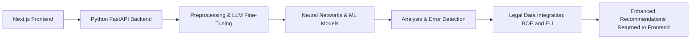

# Project Visual Overview

## Architecture

- The frontend is built with Next.js to handle user interactions and display results.
- The backend uses Python FastAPI to manage data ingestion, custom LLM fine-tuning, and other ML tasks.
- Preprocessing modules extract textual information, prepare it for neural network analysis, and integrate BOE/EU sources.
- ML components run advanced analysis on incoming documents, highlighting errors and suggesting improvements.
- Results and recommendations are returned to the Next.js application for dynamic user feedback.
