# CertyLex LLM Project Hardware & Model Configuration

**Repository**: [0xGeN02/CertyLex](https://github.com/0xGeN02/CertyLex)

---

## 🖥️ Hardware Specifications

### **CPU**

| Component          | Details                                  |
|---------------------|------------------------------------------|
| Model               | AMD Ryzen 5 7600X                        |
| Clock Speed         | 5.46 GHz (Boost)                        |
| Architecture        | Zen 4 (6-core/12-thread)                |

### **Graphics Processing**

| Component          | Details                                  |
|---------------------|------------------------------------------|
| Primary GPU         | NVIDIA GeForce RTX 4060                 |
| VRAM                | 8 GB GDDR6                              |
| Driver              | Proprietary 570.133.07 (CUDA 12.8)      |
| Secondary GPU       | AMD Raphael (Integrated)                |
| Driver              | amdgpu (Open-source)                    |

### **System Overview**

| Specification       | Details                                  |
|---------------------|------------------------------------------|
| OS                  | Arch Linux (84 days since install)       |
| Kernel              | 6.14.2-arch1-1                          |
| Window Manager      | Hyprland (Wayland compositor)           |
| Memory              | 30.51 GiB DDR5 (28% used)               |
| Display             | 1920x1080 @ 165Hz (External)            |
| Uptime              | 16 hours 31 minutes                     |

---

## 🤖 LLM Models & Use Cases

### **Available Models (via Ollama)**

| Model Name          | Parameters | Size   | Primary Function                           |
|---------------------|------------|--------|--------------------------------------------|
| `deepseek-r1:32b`   | 32B        | 19 GB  | Heavy reasoning & complex tasks            |
| `deepseek-r1:8b`    | 8B         | 4.9 GB | High-speed processing tasks                |
| `llama3.2:3b`       | 3B         | 2.0 GB | Spanish→English translation & prompt formatting |
| `llama3.2-vision:11b` | 11B      | 7.9 GB | Image processing pipeline                  |

---

## ⚙️ Workflow Architecture

```mermaid
graph LR
    A[User Input] --> B[llama3.2:3b]
    B --> C{Input Type?}
    C -->|Text| D[Spanish→English Translation]
    C -->|Image| E[llama3.2-vision:11b]
    D --> F[Prompt Standardization]
    F --> G[deepseek-r1:32b/8b]
    E --> G
    G --> H[Output Generation]
```



## Key Pipeline Features

1. Multilingual Support:

    Dedicated 3B model for real-time Spanish→English translation

    Ensures consistent prompt formatting for main models

2. Resource Optimization:

    ```sh
    # Typical GPU Utilization:

    +---------------------+------------------+
    | VRAM Allocation     | 526/8192 MB (6%) |
    | GPU Compute Load    | 40%              |
    +---------------------+------------------+
    ```

    Lightweight translation layer preserves VRAM for core models

    Automatic model selection based on task complexity

3. Vision Integration:

    11B vision model handles multimodal inputs

    Feature extraction → Textual representation → DeepSeek processing

---

## 🚀 Optimization Recommendations

### Hardware Utilization

```bash
# Suggested Monitoring Command:
watch -n 1 "nvidia-smi --query-gpu=utilization.gpu,memory.used --format=csv"
```

## ⚙️ Model Configuration

### **Tuning Recommendations**

| Tuning Aspect          | Recommendation                                                                 |
|------------------------|--------------------------------------------------------------------------------|
| **Quantization**       | Apply Q4_K_M quantization to `deepseek-r1:32b` for optimal performance/VRAM balance |
| **GPU Layer Offloading** | Configure 35+ GPU layers for 32B model:<br>`OLLAMA_NUM_GPU_LAYERS=35 ollama run deepseek-r1:32b` |
| **Batch Processing**   | Utilize `deepseek-r1:8b` for parallel request handling via:<br>`ollama serve --max-batch 8` |

---

## 🚧 Future Improvements Roadmap

### **Optimization Targets**

1. **Model Caching System**

   ```bash
   # Example caching setup for translation model
   ollama create cache-llama3.2:3b -f Modelfile.cache
    ```

2. Implement LRU caching for frequent Spanish→English translations

    - Reduce redundant processing of similar prompts

    - Vision Model Quantization

        - Target FP8 quantization for llama3.2-vision:11b

        - Requirements:

            CUDA 12.8+ enabled

            Custom CUDA kernels for FP8 support

3. Resource Allocation Strategy

    ```bash
    # CPU offloading example for translation layer
    OLLAMA_NUM_CPU=6 OLLAMA_KEEP_ALIVE=5m ollama run llama3.2:3b
    ```

4. GPU

    ```shell
    ❯ nvidia-smi
    Fri Apr 18 14:14:29 2025       
    +-----------------------------------------------------------------------------------------+
    | NVIDIA-SMI 570.133.07             Driver Version: 570.133.07     CUDA Version: 12.8     |
    |-----------------------------------------+------------------------+----------------------+
    | GPU  Name                 Persistence-M | Bus-Id          Disp.A | Volatile Uncorr. ECC |
    | Fan  Temp   Perf          Pwr:Usage/Cap |           Memory-Usage | GPU-Util  Compute M. |
    |                                         |                        |               MIG M. |
    |=========================================+========================+======================|
    |   0  NVIDIA GeForce RTX 4060        Off |   00000000:01:00.0  On |                  N/A |
    |  0%   39C    P8            N/A  /  115W |     526MiB /   8188MiB |     40%      Default |
    |                                         |                        |                  N/A |
    +-----------------------------------------+------------------------+----------------------+
                                                                                            
    +-----------------------------------------------------------------------------------------+
    | Processes:                                                                              |
    |  GPU   GI   CI              PID   Type   Process name                        GPU Memory |
    |        ID   ID                                                               Usage      |
    |=========================================================================================|
    |    0   N/A  N/A             881      G   /usr/lib/Xorg                            15MiB |
    |    0   N/A  N/A             968      G   Hyprland                                157MiB |
    |    0   N/A  N/A            1159      G   Xwayland                                  2MiB |
    |    0   N/A  N/A            1822      G   /usr/lib/firefox/firefox                184MiB |
    |    0   N/A  N/A            2300      G   kitty                                    27MiB |
    |    0   N/A  N/A          224299      G   kitty                                    27MiB |
    +-----------------------------------------------------------------------------------------+
    ```

5. OS + CPU

    ```bash
    ❯ fastfetch
                    -`                        : Segmentation fault (core dumped)
                    .o+`                    ┌──────────────────────────────────────────┐
                    `ooo/                      󰇺 Chassis : Desktop  
                `+oooo:                        󰣇 OS : Arch Linux
                `+oooooo:                       Kernel : 6.14.2-arch1-1
                -+oooooo+:                     󰏗 Packages : 1567 (pacman), 38 (flatpak-user)
                `/:-:++oooo+:                  󰍹 Display : 1920x1080 @ 165Hz [External]
            `/++++/+++++++:                     Terminal : kitty 0.41.1
            `/++++++++++++++:                  󱗃 WM : Hyprland
            `/+++ooooooooooooo/`            └──────────────────────────────────────────┘
            ./ooosssso++osssssso+`
        .oossssso-````/ossssss+`             : xgen0 @ arch-home
        -osssssso.      :ssssssso.         ┌──────────────────────────────────────────┐
        :osssssss/        osssso+++.           CPU : AMD Ryzen 5 7600X @ 5.46 GHz
        /ossssssss/        +ssssooo/-         󰊴 GPU : AMD Raphael
    `/ossssso+/:-        -:/+osssso+-         󰊴 GPU : NVIDIA GeForce RTX 4060
    `+sso+:-`                 `.-/+oso:        GPU Driver : amdgpu
    `++:.                           `-/+/      GPU Driver : nvidia (proprietary) 570.133.07
    .`                                 `/      Memory  : 8.67 GiB / 30.51 GiB (28%)
                                              󱦟 OS Age  : 84 days
                                              󱫐 Uptime  : 16 hours, 31 mins
                                            └──────────────────────────────────────────┘
                                            ● ● ● ● ● ● ● ●
    ```
