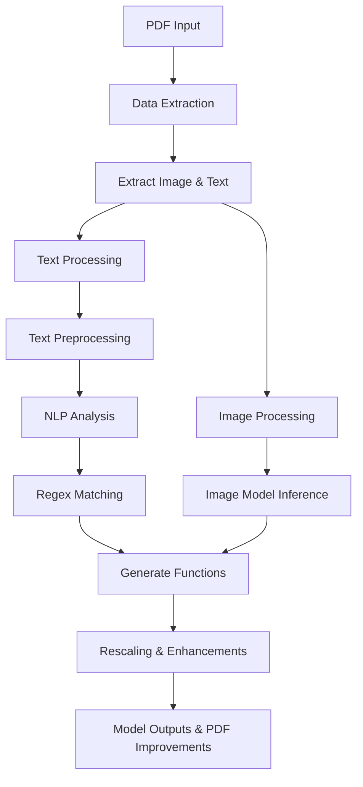

# Project Pipeline Overview

This project processes PDF files by extracting data and then handling both images and text through separate pipelines. The text undergoes cleaning, NLP processing, and regex matching, while the image is processed by a dedicated model. Finally, the models generate functions (e.g., rescaling) and provide improvements based on the user's PDF input.

## Pipeline Diagram

## Pipeline Steps

1. **PDF Input**:  
   The user provides a PDF that serves as the primary input.

2. **Data Extraction**:  
   The system extracts all necessary components from the PDF, including images and text.

3. **Extract Image & Text**:  
   The extracted data is split into two paths:
   - **Text**: For further processing.
   - **Image**: For image-specific model analysis.

4. **Text Processing**:
   - **Text Preprocessing**:  
     Clean and prepare the text for further analysis.
   - **NLP Analysis**:  
     Use NLP techniques to extract semantic information and insights.
   - **Regex Matching**:  
     Apply regex patterns to identify and extract specific data features.

5. **Image Processing**:
   - **Image Model Inference**:  
     Convert the image input using a model to extract visual information.

6. **Generate Functions**:  
   The outputs from both text and image processing are used to generate actionable functions such as rescaling, which align with the project’s goals to improve the original PDF input.

7. **Model Outputs & PDF Improvements**:  
   The final output consists of improved data representations and actionable insights, refining the user's PDF input.

This detailed pipeline diagram and explanation provide an overview of how your project processes PDFs, handling both text and visual data effectively.